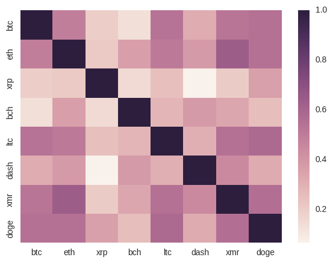
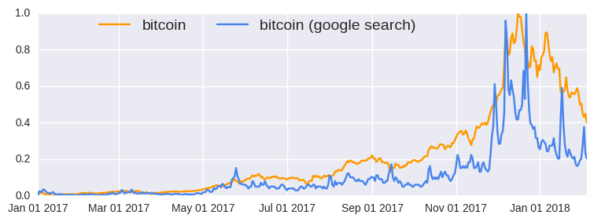

# cryptory

Retrieve historical cryptocurrency and other related data.

`cryptory` integrates various sources of historical crypto data, so that you can perform analysis and build models without having to worry about knowing different packages and APIs. Current data sources include:

-  Daily historical prices
-  Additional cryptocurrency information (transaction fees, active adressess, etc.)
-  Reddit metrics (e.g. subscriber growth)
-  Google Trends (via [Pytrends](https://github.com/GeneralMills/pytrends))
-  Stock market
-  Foreign exchange rates
-  Commodity prices


## Installation

```bash
$ pip install cryptory
```

### Compatibility

* Python 2.7+
* Python 3

### Dependencies

-  pandas>=0.17.0
-  numpy>=1.10.0
-  pytrends>=4.0.0
-  beautifulsoup4>=4.0.0

## How to Use

Consult the documentation `help(Cryptory)` for more information on its usage.

### Basic Usage

```python
# load package
from cryptory import Cryptory

# initialise object 
# pull data from start of 2017 to present day
my_cryptory = Cryptory(from_date = "2017-01-01")

# get historical bitcoin prices from coinmarketcap
my_cryptory.extract_coinmarketcap("bitcoin")
```


<div>
<style scoped>
    .dataframe tbody tr th:only-of-type {
        vertical-align: middle;
    }

    .dataframe tbody tr th {
        vertical-align: top;
    }

    .dataframe thead th {
        text-align: right;
    }
</style>
<table border="1" class="dataframe">
  <thead>
    <tr style="text-align: right;">
      <th></th>
      <th>date</th>
      <th>open</th>
      <th>high</th>
      <th>low</th>
      <th>close</th>
      <th>volume</th>
      <th>market cap</th>
    </tr>
  </thead>
  <tbody>
    <tr>
      <th>0</th>
      <td>2018-02-05</td>
      <td>8270.54</td>
      <td>8364.84</td>
      <td>6756.68</td>
      <td>6955.27</td>
      <td>9285290000</td>
      <td>139325000000</td>
    </tr>
    <tr>
      <th>1</th>
      <td>2018-02-04</td>
      <td>9175.70</td>
      <td>9334.87</td>
      <td>8031.22</td>
      <td>8277.01</td>
      <td>7073550000</td>
      <td>154553000000</td>
    </tr>
    <tr>
      <th>...</th>
      <td>...</td>
      <td>...</td>
      <td>...</td>
      <td>...</td>
      <td>...</td>
      <td>...</td>
      <td>...</td>
    </tr>
    <tr>
      <th>399</th>
      <td>2017-01-02</td>
      <td>998.62</td>
      <td>1031.39</td>
      <td>996.70</td>
      <td>1021.75</td>
      <td>222185000</td>
      <td>16055100000</td>
    </tr>
    <tr>
      <th>400</th>
      <td>2017-01-01</td>
      <td>963.66</td>
      <td>1003.08</td>
      <td>958.70</td>
      <td>998.33</td>
      <td>147775000</td>
      <td>15491200000</td>
    </tr>
  </tbody>
</table>
<p>401 rows × 7 columns</p>
</div>


```python
# get daily subscriber numbers to the bitcoin reddit page
my_cryptory.extract_reddit_metrics(subreddit="bitcoin",
                                    metric="total-subscribers")
```


<div>
<style scoped>
    .dataframe tbody tr th:only-of-type {
        vertical-align: middle;
    }

    .dataframe tbody tr th {
        vertical-align: top;
    }

    .dataframe thead th {
        text-align: right;
    }
</style>
<table border="1" class="dataframe">
  <thead>
    <tr style="text-align: right;">
      <th></th>
      <th>date</th>
      <th>total_subscribers</th>
    </tr>
  </thead>
  <tbody>
    <tr>
      <th>0</th>
      <td>2018-02-05</td>
      <td>724381</td>
    </tr>
    <tr>
      <th>1</th>
      <td>2018-02-04</td>
      <td>721827</td>
    </tr>
    <tr>
      <th>...</th>
      <td>...</td>
      <td>...</td>
    </tr>
    <tr>
      <th>401</th>
      <td>2017-01-02</td>
      <td>199275</td>
    </tr>
    <tr>
      <th>402</th>
      <td>2017-01-01</td>
      <td>198612</td>
    </tr>
  </tbody>
</table>
<p>403 rows × 2 columns</p>
</div>


```python
# google trends- bitcoin search results
my_cryptory.get_google_trends(kw_list=["bitcoin"])
```


<div>
<style scoped>
    .dataframe tbody tr th:only-of-type {
        vertical-align: middle;
    }

    .dataframe tbody tr th {
        vertical-align: top;
    }

    .dataframe thead th {
        text-align: right;
    }
</style>
<table border="1" class="dataframe">
  <thead>
    <tr style="text-align: right;">
      <th></th>
      <th>date</th>
      <th>bitcoin</th>
    </tr>
  </thead>
  <tbody>
    <tr>
      <th>0</th>
      <td>2018-02-04</td>
      <td>22.000000</td>
    </tr>
    <tr>
      <th>1</th>
      <td>2018-02-03</td>
      <td>25.000000</td>
    </tr>
    <tr>
      <th>...</th>
      <td>...</td>
      <td>...</td>
    </tr>
    <tr>
      <th>398</th>
      <td>2017-01-02</td>
      <td>4.577738</td>
    </tr>
    <tr>
      <th>399</th>
      <td>2017-01-01</td>
      <td>2.749554</td>
    </tr>
  </tbody>
</table>
<p>400 rows × 2 columns</p>
</div>


```python
# dow jones price (market code from yahoo finance)
my_cryptory.get_stock_prices(market="%5EDJI")
```


<div>
<style scoped>
    .dataframe tbody tr th:only-of-type {
        vertical-align: middle;
    }

    .dataframe tbody tr th {
        vertical-align: top;
    }

    .dataframe thead th {
        text-align: right;
    }
</style>
<table border="1" class="dataframe">
  <thead>
    <tr style="text-align: right;">
      <th></th>
      <th>date</th>
      <th>adjclose</th>
      <th>close</th>
      <th>high</th>
      <th>low</th>
      <th>open</th>
      <th>volume</th>
    </tr>
  </thead>
  <tbody>
    <tr>
      <th>0</th>
      <td>2018-02-06</td>
      <td>24912.769531</td>
      <td>24912.769531</td>
      <td>24946.230469</td>
      <td>23778.740234</td>
      <td>24085.169922</td>
      <td>817444411.0</td>
    </tr>
    <tr>
      <th>1</th>
      <td>2018-02-05</td>
      <td>24345.750000</td>
      <td>24345.750000</td>
      <td>25520.529297</td>
      <td>23923.880859</td>
      <td>25337.869141</td>
      <td>714450000.0</td>
    </tr>
    <tr>
      <th>...</th>
      <td>...</td>
      <td>...</td>
      <td>...</td>
      <td>...</td>
      <td>...</td>
      <td>...</td>
      <td>...</td>
    </tr>
    <tr>
      <th>400</th>
      <td>2017-01-02</td>
      <td>NaN</td>
      <td>NaN</td>
      <td>NaN</td>
      <td>NaN</td>
      <td>NaN</td>
      <td>NaN</td>
    </tr>
    <tr>
      <th>401</th>
      <td>2017-01-01</td>
      <td>NaN</td>
      <td>NaN</td>
      <td>NaN</td>
      <td>NaN</td>
      <td>NaN</td>
      <td>NaN</td>
    </tr>
  </tbody>
</table>
<p>402 rows × 7 columns</p>
</div>


```python
# USD/EUR exchange rate
my_cryptory.get_exchange_rates(from_currency="USD", to_currency="EUR")
```


<div>
<style scoped>
    .dataframe tbody tr th:only-of-type {
        vertical-align: middle;
    }

    .dataframe tbody tr th {
        vertical-align: top;
    }

    .dataframe thead th {
        text-align: right;
    }
</style>
<table border="1" class="dataframe">
  <thead>
    <tr style="text-align: right;">
      <th></th>
      <th>date</th>
      <th>exch_rate</th>
    </tr>
  </thead>
  <tbody>
    <tr>
      <th>0</th>
      <td>2018-02-06</td>
      <td>1.2329</td>
    </tr>
    <tr>
      <th>1</th>
      <td>2018-02-05</td>
      <td>1.2440</td>
    </tr>
    <tr>
      <th>...</th>
      <td>...</td>
      <td>...</td>
    </tr>
    <tr>
      <th>400</th>
      <td>2017-01-02</td>
      <td>NaN</td>
    </tr>
    <tr>
      <th>401</th>
      <td>2017-01-01</td>
      <td>NaN</td>
    </tr>
  </tbody>
</table>
<p>402 rows × 2 columns</p>
</div>


```python
# get historical commodity prices
my_cryptory.get_metal_prices()
```


<div>
<style scoped>
    .dataframe tbody tr th:only-of-type {
        vertical-align: middle;
    }

    .dataframe tbody tr th {
        vertical-align: top;
    }

    .dataframe thead th {
        text-align: right;
    }
</style>
<table border="1" class="dataframe">
  <thead>
    <tr style="text-align: right;">
      <th></th>
      <th>date</th>
      <th>gold_am</th>
      <th>gold_pm</th>
      <th>silver</th>
      <th>platinum_am</th>
      <th>platinum_pm</th>
      <th>palladium_am</th>
      <th>palladium_pm</th>
    </tr>
  </thead>
  <tbody>
    <tr>
      <th>0</th>
      <td>2018-02-06</td>
      <td>1337.1</td>
      <td>1333.6</td>
      <td>16.875</td>
      <td>994.0</td>
      <td>995.0</td>
      <td>1038.0</td>
      <td>1041.0</td>
    </tr>
    <tr>
      <th>1</th>
      <td>2018-02-05</td>
      <td>1337.1</td>
      <td>1333.6</td>
      <td>16.875</td>
      <td>994.0</td>
      <td>995.0</td>
      <td>1038.0</td>
      <td>1041.0</td>
    </tr>
    <tr>
      <th>...</th>
      <td>...</td>
      <td>...</td>
      <td>...</td>
      <td>...</td>
      <td>...</td>
      <td>...</td>
      <td>...</td>
      <td>...</td>
    </tr>
    <tr>
      <th>400</th>
      <td>2017-01-02</td>
      <td>NaN</td>
      <td>NaN</td>
      <td>NaN</td>
      <td>NaN</td>
      <td>NaN</td>
      <td>NaN</td>
      <td>NaN</td>
    </tr>
    <tr>
      <th>401</th>
      <td>2017-01-01</td>
      <td>NaN</td>
      <td>NaN</td>
      <td>NaN</td>
      <td>NaN</td>
      <td>NaN</td>
      <td>NaN</td>
      <td>NaN</td>
    </tr>
  </tbody>
</table>
<p>402 rows × 8 columns</p>
</div>


Note that `NaNs` occur when on days when trading was closed (e.g. weekends). You have the option to carry over the previous values, where it exists (see `help(Cryptory.__init__)` for more information).

### Advanced Usage

As all `cryptory` methods return a pandas dataframe, it's relatively easy to combine results and perform more complex calculations.


```python
# generate price correlation matrix
import pandas as pd
import seaborn as sns
import matplotlib.pyplot as plt

all_coins_df = my_cryptory.extract_bitinfocharts("btc")
# coins of interest
bitinfocoins = ["btc", "eth", "xrp", "bch", "ltc", "dash", "xmr", "doge"]
for coin in bitinfocoins[1:]:
    all_coins_df = all_coins_df.merge(my_cryptory.extract_bitinfocharts(coin), on="date", how="left")
# date column not need for upcoming calculations
all_coins_df = all_coins_df.drop('date', axis=1)
corr = all_coins_df.pct_change().corr(method='pearson')
fig, ax = plt.subplots(figsize=(7,5))  
sns.heatmap(corr, 
            xticklabels=[col.replace("_price", "") for col in corr.columns.values],
            yticklabels=[col.replace("_price", "") for col in corr.columns.values],
            annot_kws={"size": 16})
plt.show()
```





```python
# overlay bitcoin price and google searches for bitcoin
btc_google = my_cryptory.get_google_trends(kw_list=['bitcoin']).merge(
    my_cryptory.extract_coinmarketcap('bitcoin')[['date','close']], 
    on='date', how='inner')

# need to scale columns (min-max scaling)
btc_google[['bitcoin','close']] = (
        btc_google[['bitcoin', 'close']]-btc_google[['bitcoin', 'close']].min())/(
        btc_google[['bitcoin', 'close']].max()-btc_google[['bitcoin', 'close']].min())

fig, ax1 = plt.subplots(1, 1, figsize=(9, 3))
ax1.set_xticks([datetime.date(j,i,1) for i in range(1,13,2) for j in range(2017,2019)])
ax1.set_xticklabels([datetime.date(j,i,1).strftime('%b %d %Y') 
                     for i in range(1,13,2) for j in range(2017,2019)])
ax1.plot(btc_google['date'].astype(datetime.datetime),
             btc_google['close'], label='bitcoin', color='#FF9900')
ax1.plot(btc_google['date'].astype(datetime.datetime),
             btc_google['bitcoin'], label="bitcoin (google search)", color='#4885ed')
ax1.legend(bbox_to_anchor=(0.1, 1), loc=2, borderaxespad=0., ncol=2, prop={'size': 14})
plt.show()
```





## Issues & Suggestions

`cryptory` relies quite strongly on scraping, which means that it can break quite easily. If you spot something not working, then raise an issue. Also, if you have any suggestions or criticism, you can also raise an issue.
